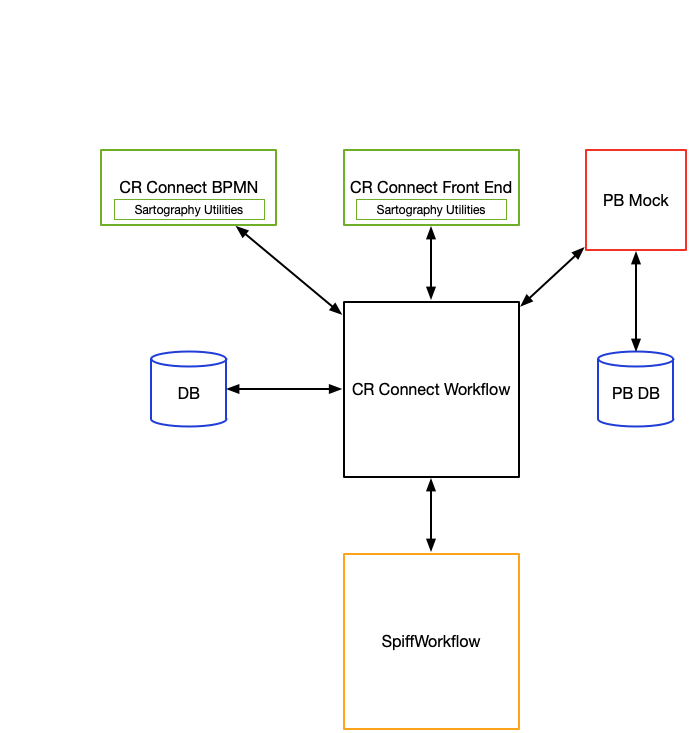
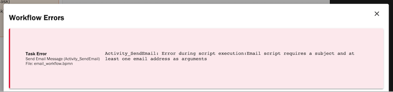

======================
CR Connect Development
======================

This is an overview for the CR Connect Development Training for UVA. It will focus on building the development environment and working with the CR Connect Workflow code base.

The examples are Unix based, but you can develop in a Windows environment.

Currently, CR Connect requires Python 3.8.

Before starting class, you should know how to:

- run python 3 on your system, and
- run pip, the python package installer, and
- install pipenv using pip

We will use pipenv to manage the CR Connect Workflow virtual environment and code requirements.


----------
CR Connect
----------

CR Connect is a collection of three code bases; **CR Connect Front End**, **CR Connect BPMN**, and **CR Connect Workflow**, and a database for persistent storage.

CR Connect Front End and CR Connect BPMN use the **Sartography Utilities** library.

CR Connect Workflow uses the **SpiffWorkflow** workflow engine.

There is a mock of **Protocol Builder** for development.

For development, we use Postgres for a database.




Code Bases
----------

SpiffWorkflow
`````````````
https://github.com/sartography/SpiffWorkflow

https://github.com/sartography/SpiffWorkflow.git

Fork of SpiffWorkflow by user knipknap on github. It is a workflow engine implemented in Python that runs our BPMN workflows.


CR Connect Workflow
```````````````````
https://github.com/sartography/cr-connect-workflow

https://github.com/sartography/cr-connect-workflow.git

API that talks to SpiffWorkflow. Written in Python. This document focuses on CR Connect Workflow.

CR Connect Frontend
```````````````````
https://github.com/sartography/cr-connect-frontend

https://github.com/sartography/cr-connect-frontend.git

Front end for UVA that talks to the API. Written in Angular

CR Connect BPMN
```````````````
https://github.com/sartography/cr-connect-bpmn

https://github.com/sartography/cr-connect-bpmn.git

Workflow modeler. Creates BPMN and DMN XML. Can upload supporting documents. Written in Angular

Protocol Builder Mock
`````````````````````
https://github.com/sartography/protocol-builder-mock

https://github.com/sartography/protocol-builder-mock.git

A mock-up of Protocol Builder. Only meant to be used during development phase. Python and HTML

Sartography Libraries
`````````````````````
https://github.com/sartography/sartography-libraries

https://github.com/sartography/sartography-libraries.git

Libraries shared by cr-connect-frontend and cr-connect-bpmn. Written in Angular.


-----------------------
Development Environment
-----------------------

There are two parts to our development environment; CR Connect Workflow, and everything else.

CR Connect Workflow is the Python code we will modify. We need a local copy of it to work with.

Everything else includes CR Connect Front End, CR Connect BPMN, Protocol Builder Mock, and the Database.

We will manage CR Connect Workflow, and use Docker to manage everything else.

Stack Deploy Generator
----------------------

Stack Deploy Generator is a Python script `stackdeploy-generator.py` that generates a docker compose file from a template. We use the docker compose file to manage the CR Connect Application Stack.

You can modify the output of Stack Deploy Generator--by passing arguments to the script or editing its default values, to fit your development process.

The arguments are in `args.csv` and the default values are in `defaults.csv`.


For class, we will use the Stack Deploy script to manage everything except CR Connect Workflow, which we will manage ourselves to allow local development.

We will clone the CR Connect Workflow repository locally, and configure the stack deploy environment to work with our local copy of Workflow. Then, we can still use Stack Deploy to manage the rest of the stack.


Deployment Example
------------------

Here is a step by step process for deploying CR Connect with Stack Deploy.

Working Directory
`````````````````

Create a working directory in a suitable location.

.. code-block::

    mkdir development

    cd development

We will use `development` as the top level of our example directory structure.

Clone from github
`````````````````

Clone CR Connect Workflow and the Stack Deploy scripts in the development directory.

Directory: development

.. code-block::

    git clone https://github.com/sartography/cr-connect-workflow.git

    git clone https://github.com/sartography/sartography-utils.git

This creates two directories; `development/cr-connect-workflow` and `development/sartography-utils`

CR Connect Workflow
```````````````````

First, we will set up CR Connect Workflow

.. code-block::

    cd cr-connect-workflow

    pipenv install --dev

Note:  If you use Visual Studio on Windows, and have trouble installing the python-Levenshtein package,
you might need to download the build tools.
https://visualstudio.microsoft.com/thank-you-downloading-visual-studio/?sku=BuildTools&rel=16

Run Stack Deploy Script
```````````````````````

Now, we will work on the deployment script in the development/sartography-utils directory.

Edit the docker-compose defaults in sartography utils

.. code-block::

    cd development/sartography-utils/stackdeploy-generator/cr_connect

Change the PATH_BASE line in defaults.csv to something appropriate.

From

.. code-block::

    "PATH_BASE","$HOME/sartography/docker-volumes/cr-connect/"

To something like

.. code-block::

    "PATH_BASE","/path/to/development/directory/docker-volumes/cr-connect/"

Create a docker-compose file from the sartography utils

.. code-block::

    cd development/sartography-utils/stackdeploy-generator/

    ./stackdeploy-generator.py -F cr_connect -c cr-connect-docker-compose.yml

This creates the file cr-connect-docker-compose.yml and the directory you specified in PATH_BASE, along with a postgres directory in PATH_BASE

Modify Docker Compose File
``````````````````````````

Now, we need to remove information about the back end from the docker compose file since we are managing it ourselves.

Edit the docker-compose file you just created `cr-connect-docker-compose.yml` and comment out the lines about the backend.


.. code-block::

    #  backend:
    #    container_name: backend
    #    depends_on:
    #       - db
    #       - pb
    #    image: cr-connect-workflow-dev
    #    environment:
    #      - APPLICATION_ROOT=/
    #      - CORS_ALLOW_ORIGINS=localhost:5002,bpmn:5002,localhost:5004,frontend:5004,localhost:4200
    #      - DB_HOST=db
    #      - DB_NAME=crc_dev
    #      - DB_PASSWORD=crc_pass
    #      - DB_PORT=5432
    #      - DB_USER=crc_user
    #      - DEVELOPMENT=true
    #      - LDAP_URL=mock
    ##      - LDAP_URL=ldap.virginia.edu
    #      - PB_BASE_URL=http://pb:5001/v2.0/
    #      - PB_ENABLED=true
    #      - PORT0=5000
    #      - PRODUCTION=false
    ##      - RESET_DB=true
    ##     - ADMIN_UIDS=ajl2j,cah3us,cl3wf # uncomment this to make the default testing user NOT admin
    #      - TESTING=false
    #      - UPGRADE_DB=true
    #    ports:
    #      - "127.0.0.1:5000:5000"
    #    command: ./wait-for-it.sh pb:5001 -t 0 -- ./docker_run.sh

Note that your code may look different from mine.

We also need to comment out 2 lines where bpmn and the front end depend on the backend.

.. code-block::

      bpmn:
        container_name: bpmn
        depends_on:
           - db
    #       - backend
           - pb


.. code-block::

      frontend:
        container_name: frontend
        depends_on:
           - db
    #       - backend
        image: sartography/cr-connect-frontend:dev


Modify CR Connect Workflow
``````````````````````````

We now need to modify CR Connect Workflow so it talks to the correct ports in the docker container.

The defaults for the docker container are

.. code-block::

    # Backend: 5000
    # Protocol builder : 5001
    # Bpmn: 5002
    # Db: 5003
    # Frontend : 5004

We only need to worry about 5003 for the database and 5004 for the front end. Everything else matches already.

Instance Config
```````````````

Flask has a built-in mechanism for modifying your configuration for local development. You can put your modifications into a **config.py** file in the **instance** directory.

Note that you may need to create the instance directory and config.py file.

Flask will read from the config.py file after loading its default configuration. The instance configuration entries will override the default configuration.

.. code-block::

    cd development/cr-connect-workflow

Create the instance directory if it does not already exist.

.. code-block::

    mkdir instance

Change to the instance directory

.. code-block::

    cd instance

Create config.py if it does not already exist.

.. code-block::

    touch config.py

Edit config.py
``````````````

These two lines tell the backend that the front end runs on port 5004, and to allow CORS for that port.

.. code-block::

    CORS_ALLOW_ORIGINS = re.split(r',\s*', environ.get('CORS_ALLOW_ORIGINS', default="localhost:4200, localhost:5002, localhost:5004"))
    FRONTEND_AUTH_CALLBACK = environ.get('FRONTEND_AUTH_CALLBACK', default="http://localhost:5004/session")

This tells the back end that the database runs on port 5003, and sets up SQLAlchemy to talk to that port.

.. code-block::

    DB_PORT = 5003
    SQLALCHEMY_DATABASE_URI = environ.get(
        'SQLALCHEMY_DATABASE_URI',
        default="postgresql://%s:%s@%s:%s/%s" % (DB_USER, DB_PASSWORD, DB_HOST, DB_PORT, DB_NAME)
    )

We also need to import the definitions we just used. Add this to the top of config.py

.. code-block::

    import re
    from os import environ
    from config.default import DB_USER, DB_PASSWORD, DB_HOST, DB_NAME


Start Back End
--------------

Use pipenv to run the CR Connect Workflow Flask application

.. code-block::

    cd ..

    pipenv run python run.py

Docker Compose
--------------

Use docker-compose to run the rest of the CR Connect application stack.

.. code-block::

    docker-compose -f cr-connect-docker-compose.yml up


Setup Database
--------------

We need to update the database tables and seed them with some example data.

From the development/cr-connect-workflow directory, run these commands.

.. code-block::

    flask db upgrade

.. code-block::

    flask load-example-data


URLs
----

You should now be able to reach these URLs.

`API <http://localhost:5000/v1.0/ui/>`_

`Dashboard <http://localhost:5004/app/home>`_

`Configurator <http://localhost:5002/bpmn/home>`_

`PB Mock <http://localhost:5001>`_


-------------------
CR-Connect-Workflow
-------------------

CR-Connect-Workflow is the API for CR-Connect. It takes requests from the front end, makes calls to SpiffWorkflow and other parts of the API, and returns JSON to the front end.

API
---

This is the code for the api endpoints, along with admin and common which contain classes and methods used by the api enpoints.

You can view the endpoints at http://localhost:5000/v1.0/ui after bringing up the stack.

- admin
- common
- data_store
- file
- study
- tools
- user
- workflow
- workflow_sync


Models
------

Database models. SQLAlchemy. We use Postgres for development.

Scripts
-------

These are the scripts that can be called from a workflow. Scripts are the focus of this tutorial.

Services
--------

These are services internal to the API. The API can call these.


-----------------
Creating a Script
-----------------

Example code: crc/scripts/tutorial.py

.. code-block:: Python

    from crc.scripts.script import Script
    import requests


    class TutorialScript(Script):

        def get_description(self):
            return """Simple script for teaching purposes"""

        def do_task_validate_only(self, task, study_id, workflow_id, *args, **kwargs):
            self.do_task(task, study_id, workflow_id, *args, **kwargs)

        def do_task(self, task, study_id, workflow_id, *args, **kwargs):
            drawn_cards = []
            if len(args) > 0:
                cards = args[0]
            else:
                cards = 1
            if len(args) > 1:
                decks = args[1]
            else:
                decks = 1

            deck_url = f'https://deckofcardsapi.com/api/deck/new/shuffle/?deck_count={decks}'
            deck_response = requests.get(deck_url)
            deck_id = deck_response.json()['deck_id']

            card_url = f'https://deckofcardsapi.com/api/deck/{deck_id}/draw/?count={cards}'
            card_response = requests.get(card_url)

            for card in range(cards):
                card_value = card_response.json()['cards'][card]['value']
                card_suit = card_response.json()['cards'][card]['suit']
                drawn_cards.append({'suit': card_suit, 'value': card_value})

            return drawn_cards

Best practice for creating a script involves creating a service that does the work, and calling the service from our script.
We cover this in the next section.


------------------
Building a Service
------------------

Services are internal code related to a specific function. We have services that manage users and studies,
interact with Protocol Builder and the LDAP server, send emails, and make calls to SpiffWorkflow.

Services should not be called directly from outside the system. They should be called by scripts, the API, and other services.

Tutorial Service
----------------

Let's build a service that replaces the do_task method in our script. We can then call the service from our script.

.. code-block:: Python

    import requests


    class TutorialService(object):

        @staticmethod
        def pick_a_card(cards, decks):
            drawn_cards = []

            deck_url = f'https://deckofcardsapi.com/api/deck/new/shuffle/?deck_count={decks}'
            deck_response = requests.get(deck_url)
            deck_id = deck_response.json()['deck_id']

            card_url = f'https://deckofcardsapi.com/api/deck/{deck_id}/draw/?count={cards}'
            card_response = requests.get(card_url)

            for card in range(cards):
                card_value = card_response.json()['cards'][card]['value']
                card_suit = card_response.json()['cards'][card]['suit']
                drawn_cards.append({'suit': card_suit, 'value': card_value})

            return drawn_cards

We can now modify our script to call this new service.

.. code-block:: Python

    from crc.scripts.script import Script
    from crc.services.tutorial_service import TutorialService

    class TutorialScript(Script):

        def get_description(self):
            return """Simple script for teaching purposes"""

        def do_task_validate_only(self, task, study_id, workflow_id, *args, **kwargs):
            self.do_task(task, study_id, workflow_id, *args, **kwargs)

        def do_task(self, task, study_id, workflow_id, *args, **kwargs):

            cards = kwargs['cards']
            decks = kwargs['decks']

            drawn_cards = TutorialService.pick_a_card(cards=cards, decks=decks)
            return drawn_cards


-------------
Writing Tests
-------------

Example code: tests/test_tutorial.py

.. code-block:: Python

    from tests.base_test import BaseTest


    class TestTutorial(BaseTest):

        def test_validate_tutorial(self):
            spec_model = self.load_test_spec('tutorial')
            response = self.app.get('/v1.0/workflow-specification/%s/validate' % spec_model.id, headers=self.logged_in_headers())
            self.assert_success(response)

        def test_draw_cards(self):

            workflow = self.create_workflow('tutorial')
            workflow_api = self.get_workflow_api(workflow)

            first_task = workflow_api.next_task
            self.assertEqual('Task_Hello', first_task.name)

            result = self.complete_form(workflow_api, first_task, {'decks': 1, 'cards': 2})
            self.assertEqual(2, len(result.next_task.data['drawn_cards']))

            card_1 = f'{result.next_task.data["drawn_cards"][0]["value"]} of {result.next_task.data["drawn_cards"][0]["suit"]}'
            card_2 = f'{result.next_task.data["drawn_cards"][1]["value"]} of {result.next_task.data["drawn_cards"][1]["suit"]}'
            self.assertEqual(f'</H1>Good Bye</H1>\n\n<div><span>{card_1}</span></div>\n\n<div><span>{card_2}</span></div>\n', result.next_task.documentation)

---------
Api Error
---------

The API defines an exception class `ApiError` that we use to return a custom error message to the user. The front end is responsible for displaying the error message.

We also define two error handlers, `handle_invalid_usage` and `handle_internal_server_error`, that return our errors in a response.

Api Error
---------

The class is defined in api/common.py. It has attributes you can use to provide information to the user.

Note that we set the status_code to 400 by default, which is bad request.

Also note that code and message do not have defaults.

.. code-block:: python

    class ApiError(Exception):
        def __init__(self, code, message, status_code=400,
                     file_name="", task_id="", task_name="", tag="", task_data = {}):
            self.status_code = status_code
            self.code = code  # a short consistent string describing the error.
            self.message = message  # A detailed message that provides more information.
            self.task_id = task_id or ""  # OPTIONAL:  The id of the task in the BPMN Diagram.
            self.task_name = task_name or ""  # OPTIONAL: The name of the task in the BPMN Diagram.
            self.file_name = file_name or ""  # OPTIONAL: The file that caused the error.
            self.tag = tag or ""  # OPTIONAL: The XML Tag that caused the issue.
            self.task_data = task_data or ""  # OPTIONAL: A snapshot of data connected to the task when error ocurred.
            if hasattr(g,'user'):
                user = g.user.uid
            else:
                user = 'Unknown'
            self.task_user = user
            # This is for sentry logging into Slack
            sentry_sdk.set_context("User", {'user': user})
            Exception.__init__(self, self.message)

CR Connect has different types of errors; errors that occur in the application, errors that occur during workflows, and errors that come from validating workflows.

**Application errors** come from python code. We do not need to show the actual python error to the user. We want to give the user a helpful message.

**Workflow errors** can happen because of a problem with our code or from a problem with the workflow. Usually, we do not want to send the stack trace to the end user.

**Validation errors** are a little different. We **do** want to pass on the python error to the user, who in this case is a configurator who may need to see the python error to understand how to solve their problem.

Application Errors
------------------

Application Errors are internal python errors from our application. As developers, we can use the stack trace produced from an error to debug our code, but they are not meant for the end user.

Instead, we send the user a message that is more helpful to them.

As an example, consider the first few lines of the `do_task` method in the email script located at crc/scripts/email.py:

The email script requires two parameters; a subject, and an address or list of addresses.

In do_task, we test whether we have two parameters. If not, we raise an error.

.. code-block:: python

    def do_task(self, task, study_id, workflow_id, *args, **kwargs):

        if len(args) < 2:
            raise ApiError(code="missing_argument",
                           message="Email script requires a subject and at least one email address as arguments")

Since ApiError does not set defaults for code and message, we provide them.


The **code** is meant to be short and descriptive. By convention it is lower case, with underscores instead of spaces. It is not displayed to the user. It is designed to be parsed programmatically.

The **message** is displayed to the user. It should describe the problem in human understandable terms. If known, it can offer a solution.




Workflow Errors
---------------

Workflow errors happen while a workflow is running. They can come from the SpiffWorkflow, or from CR Connect.

We have two ApiError methods we can call


Validation Errors
-----------------

Validation errors are a different type of user error. They occur when configurators validate their workflows using the shield icon in the configurator toolbar.

In this case, we **do** want to send the stack trace to the user to help them troubleshoot their problem.

For a validation example, consider the